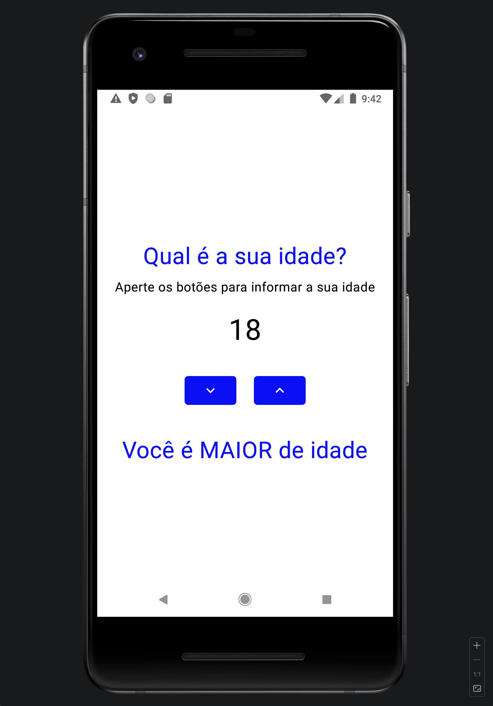

# Layout validador de maioridade

## Descrição
Este projeto foi desenvolvido com fins educacionais para demonstrar conceitos fundamentais de desenvolvimento Android utilizando Jetpack Compose.
O objetivo principal é explorar a criação de interfaces modernas e reativas, aplicando componentes de estado para controlar e atualizar dinamicamente os elementos da interface.

## Tecnologias

* Kotlin
* Jetpack Compose
* Android Studio
* Git

## Autor
[Pedro Henrique]()